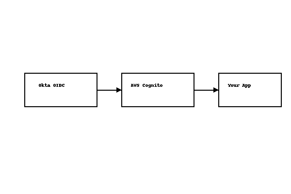

# AmazonCognitoUserPools
Amazon Cognito UserPools- Cloudformation &amp; Terraform
# 🚀 Amazon Cognito UserPools with Okta Integration

This repository contains **end-to-end labs** to integrate **Amazon Cognito UserPools with Okta** using both **CloudFormation** and **Terraform**.  
Choose the IaC tool you prefer and follow the respective setup instructions.

---

## 📌 Architecture


- Okta OIDC App or SAML IdP created via Okta REST API/CLI
- Amazon Cognito User Pool with Okta configured as an Identity Provider
- Cognito Hosted UI for login, integrated with your application

---

## 📂 Repository Structure

```bash
cognito-okta-infra/
├── cloudformation/
│   ├── cognito-okta-full.yml
│   └── README.md
├── terraform/
│   ├── main.tf
│   ├── variables.tf
│   ├── outputs.tf
│   ├── scripts/
│   │   ├── deploy.sh
│   │   └── destroy.sh
│   └── README.md
├── okta-scripts/
│   ├── okta-create-oidc.sh
│   ├── okta-create-saml.sh
├── .github/
│   └── workflows/
│       ├── terraform-ci.yml
│       └── cloudformation-ci.yml
├── diagram.png
└── README.md
```
      
### 🛠️ Prerequisites
- Okta Org with Admin privileges
- Okta API Token
- AWS CLI configured with IAM rights to create Cognito resources

Tools installed:
- curl, jq, awscli, terraform (if using Terraform)

### 🚦 Quick Start
- Option 1: Using CloudFormation
Go to cloudformation/
- Follow the step-by-step instructions
Deploy using AWS CLI:
```bash
aws cloudformation deploy \
  --template-file cloudformation/cognito-okta-full.yml \
  --stack-name CognitoOktaStack \
  --capabilities CAPABILITY_NAMED_IAM
```
### Option 2: Using Terraform
- Go to amazon-cognito-user-pools-okta/
- Copy terraform.tfvars.example → terraform.tfvars and update values

Initialize and apply:
```bash
cd amazon-cognito-user-pools-okta
terraform init
terraform apply -auto-approve
```

- To destroy:
  terraform destroy -auto-approve

- 🔧 Automation Scripts
```bash
scripts/okta-create-oidc.sh
```
 → Automates Okta OIDC App creation
```bash
scripts/okta-create-saml.sh
```
 → Automates SAML IdP setup in Okta

### ✅ Next Steps

Test Cognito Hosted UI URL:
```
https://<CognitoDomainPrefix>.auth.<region>.amazoncognito.com/oauth2/authorize...
```

Try login via Okta and validate token claims.
