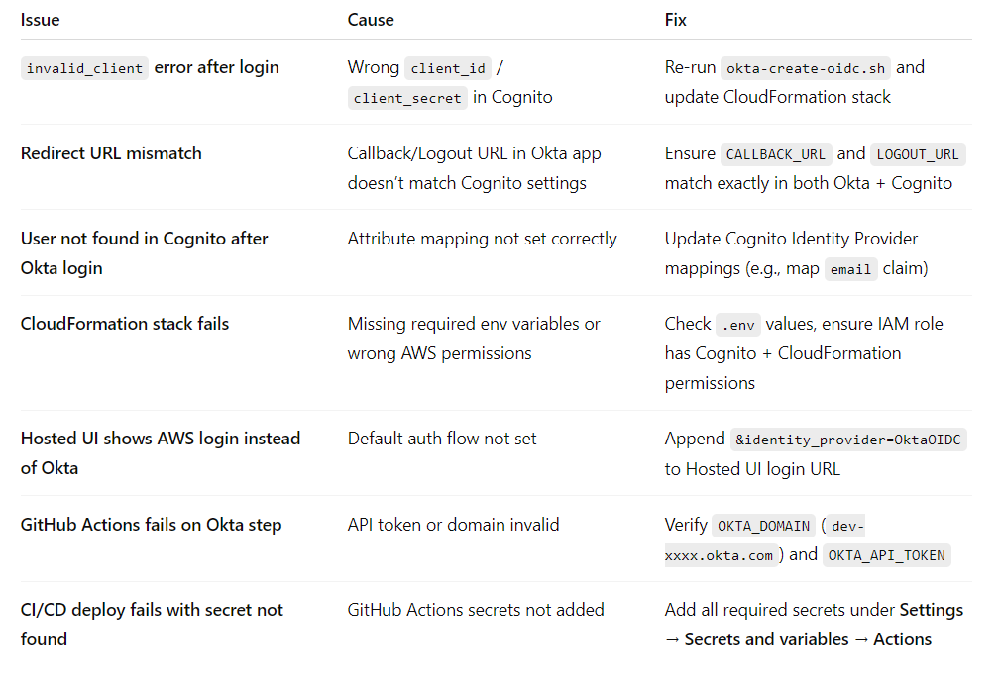
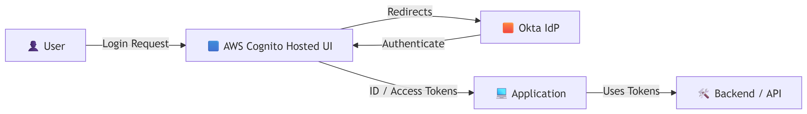

# AWS Workspace Directory: Amazon Cognito User Pools with Okta SSO using Cloudformation

This repository automates the creation of an Okta OIDC app and the deployment of an AWS Cognito User Pool configured to use Okta as an OIDC provider.
It integrates Okta and AWS Cognito using:
- Okta REST API / CLI → Automates creation of the OIDC app and optional SAML IdP
- CloudFormation → Creates a Cognito User Pool configured with Okta as an OIDC IdP
- GitHub Actions → CI/CD workflow to provision everything end-to-end

### 📦 Repo Structure
 ```bash
cognito-okta-integration/
├── .env.template                 # Example environment variables
├── .gitignore
├── LICENSE                       # MIT license
├── README.md                     # This guide
├── cloudformation/
│   └── cognito-okta-full.yml     # CloudFormation template for Cognito + Okta IdP
├── deploy/
│   └── deploy.sh                 # Script to deploy CloudFormation manually
├── scripts/
│   ├── okta-create-oidc.sh       # Script to create OIDC app in Okta
│   └── okta-create-saml.sh       # Script to create SAML IdP in Okta (optional)
└── .github/
    └── workflows/
        └── deploy.yml            # GitHub Actions CI workflow
 ```
---
## What is included
- `scripts/okta-create-oidc.sh` — creates an Okta OIDC app (writes `outputs/okta_oidc.json`)
- `scripts/okta-create-saml.sh` — example script for creating a SAML IdP in Okta (optional)
- `cloudformation/cognito-okta-full.yml` — CloudFormation template to create Cognito User Pool and OIDC provider
- `deploy/deploy.sh` — wrapper to deploy the CloudFormation stack using env vars
- `.github/workflows/deploy.yml` — GitHub Actions workflow to run the Okta script and deploy CF
- `.env.template`, `.gitignore`, `LICENSE`
- `outputs/` (ignored by git) — where runtime outputs are written

## Prerequisites
- Okta organization with Admin access and an API token
- AWS account with permissions for Cognito and CloudFormation
Tools installed locally:
- `aws` CLI (configured)
- `curl, jq, bash` installed (locally or in CI)
- (Optional) GitHub repository for CI/CD running Actions workflow

### 🔑 Required Environment Variables
Set these in your .env file or CI secrets:
- OKTA_DOMAIN → e.g. dev-123456.okta.com
- OKTA_API_TOKEN → API token from Okta
- COGNITO_DOMAIN_PREFIX → e.g. myoktapool
- CALLBACK_URL → Your app callback (e.g. https://myapp.example.com/callback)
- LOGOUT_URL → Logout redirect (e.g. https://myapp.example.com/logout)
- USER_POOL_NAME → Name for Cognito User Pool

## Step-by-step (local workflow)
### 🚀 Local Deployment Steps
1.  Clone the repo and navigate into it:
   ```bash
git clone https://github.com/mohammadshakirsaifi/AmazonCognitoUserPools.git
cd AmazonCognitoUserPools
   ```

3. Copy `.env.template` to `.env` and fill values:
   ```bash
   cp .env.template .env
   # Edit .env and fill in OKTA_DOMAIN, OKTA_API_TOKEN, etc.
   ```

4. Make scripts executable:
   ```bash
   chmod +x scripts/*.sh deploy/*.sh
   ```

5. Create Okta OIDC app (local):
   ```bash
   # ensure OKTA_DOMAIN and OKTA_API_TOKEN are set (or in .env)
   ./scripts/okta-create-oidc.sh
   ```
This script will:
- Create an OIDC app in Okta
- Output client_id and client_secret into outputs/okta_oidc.json
-  This writes `outputs/okta_oidc.json` with the full Okta response. ⚠️Do **not** commit that file.

6. Deploy CloudFormation locally:
   - Export the values from `outputs/okta_oidc.json` or copy them into your environment:
     ```bash
     export OktaClientId=$(jq -r '.credentials.oauthClient.client_id' outputs/okta_oidc.json)
     export OktaClientSecret=$(jq -r '.credentials.oauthClient.client_secret' outputs/okta_oidc.json)
     export OktaIssuerUrl="https://<your-okta-domain>/oauth2/default"
     export CognitoDomainPrefix="myoktapool"
     export CallbackURL="https://myapp.example.com/callback"
     export LogoutURL="https://myapp.example.com/logout"
     ```
   - Run the deploy wrapper:
     ```bash
     ./deploy/deploy.sh
     ```
This runs CloudFormation and provisions:
- Cognito User Pool
- Cognito App Client
- Cognito Domain
- OIDC IdP (Okta)

7. Test the Hosted UI:
   ```
   https://<CognitoDomainPrefix>.auth.<region>.amazoncognito.com/oauth2/authorize?response_type=code&client_id=<CognitoAppClientId>&redirect_uri=<CallbackURL>&scope=openid+email+profile&identity_provider=OktaOIDC
   ```

## 🔄 CI/CD with GitHub Actions
1. Push this repository to GitHub.
2. Add the following secrets in Repository Settings → Actions → Secrets and variables:
   - `AWS_ACCESS_KEY_ID`
   - `AWS_SECRET_ACCESS_KEY`
   - `OKTA_DOMAIN` (e.g. dev-12345.okta.com)
   - `OKTA_API_TOKEN`
   - `COGNITO_DOMAIN_PREFIX`
   - `CALLBACK_URL`
   - `LOGOUT_URL`
   - `USER_POOL_NAME`
4. Trigger the workflow from Actions → "Deploy Cognito-Okta Integration" (or push to `main`).
   The workflow will:
   - Run `scripts/okta-create-oidc.sh` to create an Okta app
   - Extract `client_id` & `client_secret`
   - Deploy the CloudFormation stack using those values

## Security notes
- Never commit .env or files in outputs/
- Rotate Okta client secrets regularly
- Use least-privilege IAM policies for deployment
- Store secrets in GitHub Secrets, not in code

## Helpful git commands
```bash
git init
git add .
git commit -m "Initial commit: Okta -> Cognito automation"
git branch -M main
git remote add origin git@github.com:mohammadshakirsaifi/AmazonCognitoUserPools.git
git push -u origin main
```
## 🛠️ Troubleshooting


## 📌 Architecture Diagram


    
    User[👤 User] -->|Login Request| Cognito[🟦 AWS Cognito Hosted UI]
    Cognito -->|Redirects| Okta[🟧 Okta IdP]
    Okta -->|Authenticate| Cognito
    Cognito -->|ID / Access Tokens| App[💻 Application]
    App -->|Uses Tokens| API[🛠️ Backend / API]
